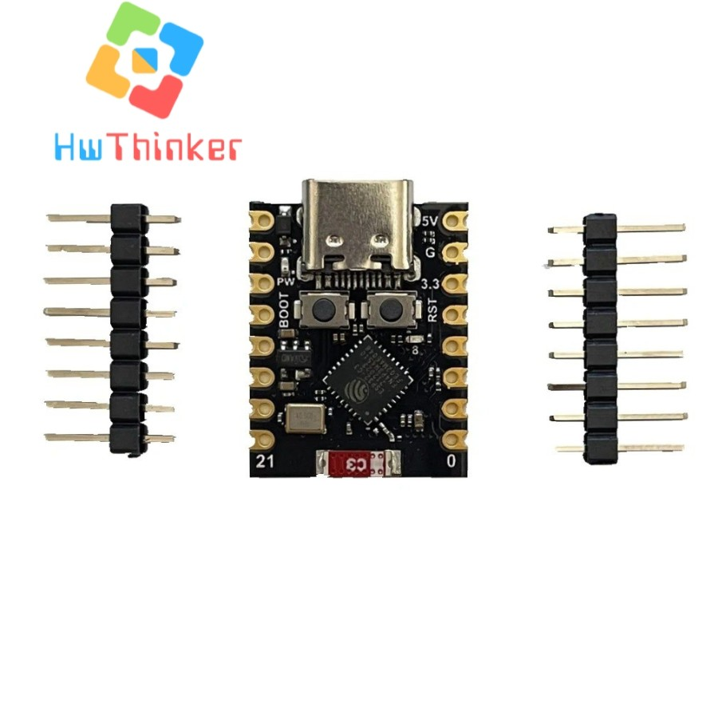
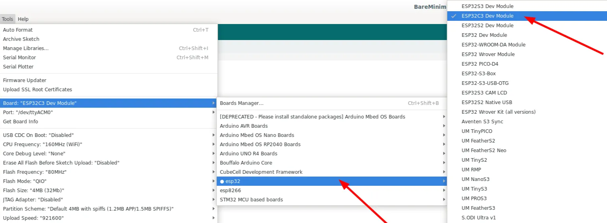
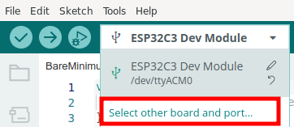
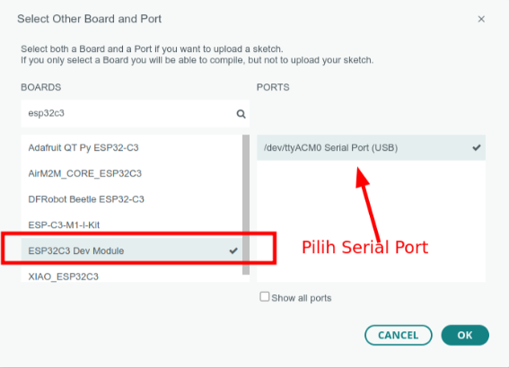
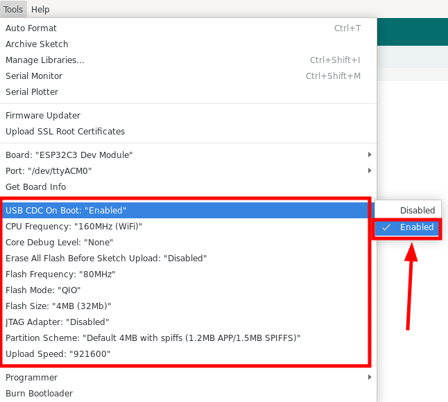
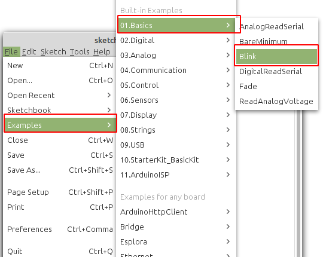
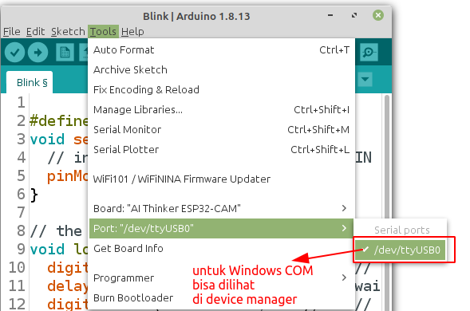
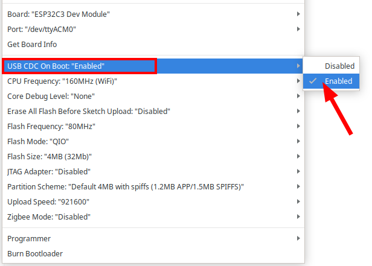
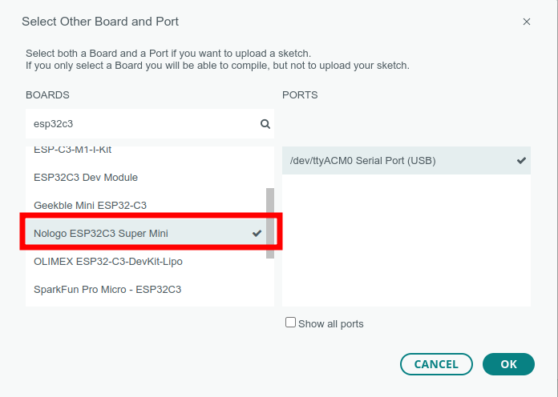

# ESP32 C3 Super Mini




## Install Board

1. Masuk ke preferences


2. Klik Additional Board Manager


3. Tambahkan board esp32 kalimat berikut https://raw.githubusercontent.com/espressif/arduino-esp32/gh-pages/package_esp32_index.json


4. Pilih Tools -> Board -> Board Manager


5. Search ESP32 kemudian klik install


6. Pilih Tools -> Board -> ESP32 -> esp32C3 dev Module



7. Untuk Arduino 2.0 bisa juga Klik board pada main bar



8. kemudian pilih ESP32C3 Dev Module



9. Ubah opsi CDC on Boot menjadi “**enable**”, ini perlu supaya serial bisa bekerja dengan baik



10. Pilih Example -> Basic -> blink



11. Setting port serial , untuk windows bisa cek device manager, pastikan anda telah install driver serial usb anda



## Upload program

**CARA UPLOAD** klik upload program di komputer. akan muncul tulisan

```cpp
- ---esptool.py v3.0-dev
- ---Serial port COM…
- ---Connecting........_____....._____.....__
```

---

- **Tekan dan tahan** tombol Boot bersamaan itu Klik(**tekan dan lepas**) tombol reset
- **Lepas** tombol reset/EN dan **tetap tekan** tombol 0/Boot . akan muncul info berikut

```cpp
- ---Compressed 261792 bytes to 122378...
- ---Writing at 0x00010000... (12 %)
- ---Writing at 0x00014000... (25 %)
- ---Writing at 0x00018000... (37 %)
```

---

- Bila sudah muncul tulisan Writing at 0x0000e000... (sekian %), maka tombol Boot boleh dilepas
- Setelah itu Wajib klik tombol **reset** sekali lagi untuk berpindah dari mode download menjadi mode run

> [!NOTE]  
> INGAT YA WAJIB Di Klik Tombol RESET setelah proses upload selesai, tanpa itu program yang baru diupload tidak akan dijalankan

---

## Contoh program blinky

Board **ESP32-C3 Super Mini** merupakan salah satu pilihan ideal untuk proyek IoT dan mikrokontroler karena ukurannya yang kecil, konsumsi daya rendah, serta dilengkapi dengan berbagai fitur seperti konektivitas Wi-Fi dan Bluetooth LE. Board ini juga dilengkapi dengan sebuah LED internal yang terhubung ke **GPIO 8**, menjadikannya sangat cocok untuk demonstrasi program sederhana seperti *Blinky*.

**Program Blinky** adalah program dasar yang digunakan untuk memulai pemrograman pada mikrokontroler. Dalam program ini, LED akan menyala dan mati secara bergantian dengan durasi tertentu. Pada board ini, LED internal akan:

- Menyala selama 100 milidetik, dan
- Mati selama 1 detik.

Kode program yang digunakan untuk mengendalikan LED internal ditulis dalam bahasa C++ menggunakan kerangka kerja **Arduino**. Berikut adalah kode lengkapnya:

```cpp
#include <Arduino.h>
int led = 8;

void setup() {
  // initialize digital pin led as an output
  pinMode(led, OUTPUT);
}

void loop() {
  digitalWrite(led, LOW);    // turn the LED on
  delay(100);               // wait for a second
  digitalWrite(led, HIGH);   // turn the LED off
  delay(1000);               // wait for a second
}
```

### Penjelasan Program:

1. **Pin GPIO**: Variabel `led` diset ke nilai 8 untuk menunjuk pin GPIO yang terhubung dengan LED internal.

2. **Fungsi `setup()`**: Fungsi ini hanya dijalankan sekali saat board dinyalakan atau di-*reset*. Di sini, pin LED diatur sebagai *output*.

3. Fungsi `loop()`

   : Fungsi ini berjalan berulang-ulang. Dalam program ini, fungsi 

   ```
   loop()
   ```

    akan:

   - Menyalakan LED dengan mengatur pin GPIO 8 ke `LOW`.
   - Menunggu 100 ms.
   - Mematikan LED dengan mengatur pin GPIO 8 ke `HIGH`.
   - Menunggu 1 detik sebelum mengulang siklusnya.

Program ini sangat cocok sebagai langkah pertama untuk memastikan board "nologo" ESP32-C3 Super Mini Anda berfungsi dengan baik dan untuk memahami dasar pemrograman mikrokontroler. Selamat mencoba! 🚀

---
## Contoh Program Serial

Board **ESP32-C3 Super Mini** mendukung komunikasi serial melalui koneksi USB yang memungkinkan pengiriman dan penerimaan data antara mikrokontroler dan komputer. Program berikut memanfaatkan fitur komunikasi serial untuk memberikan informasi status LED (ON/OFF) secara real-time ke *Serial Monitor*.

Sebelum menjalankan program ini, pastikan untuk mengaktifkan opsi **USB CDC on Boot** melalui pengaturan pada menu **Tools** di Arduino IDE agar komunikasi serial dapat berjalan dengan baik. Pengaturan ini memastikan board dapat menggunakan port USB internal untuk komunikasi serial.



### Fitur Program:

1. Mengontrol LED internal pada **GPIO 8** untuk menyala dan mati secara bergantian.
2. Mengirimkan status LED ("ON" atau "OFF") ke *Serial Monitor* pada kecepatan komunikasi 9600 baud.

Berikut adalah kode lengkapnya:

```c++
#include <Arduino.h>
int led = 8;

void setup() {
  // initialize digital pin led as an output
  pinMode(led, OUTPUT);
  Serial.begin(9600);
}

void loop() {
  digitalWrite(led, LOW);    // turn the LED on
  delay(100);               // wait for a second
  Serial.println("OFF");
  digitalWrite(led, HIGH);   // turn the LED off
  delay(1000);               // wait for a second
  Serial.println("ON");
}
```

###  Penjelasan Program:

1. **Pin GPIO**: Sama seperti pada program Blinky, pin `led` menunjuk ke GPIO 8, tempat LED internal terhubung.

2. **Fungsi `Serial.begin(9600)`**: Mengaktifkan komunikasi serial pada baud rate 9600. Fungsi ini memungkinkan board mengirimkan data melalui port USB ke komputer.

3. **Fungsi `Serial.println()`**: Mengirimkan string teks ke *Serial Monitor*. Program ini mengirimkan "ON" ketika LED mati dan "OFF" ketika LED menyala.

4. Siklus `loop()`

   :

   - Menyalakan LED (`LOW`) selama 100 ms.
   - Mengirimkan teks "OFF" ke *Serial Monitor*.
   - Mematikan LED (`HIGH`) selama 1 detik.
   - Mengirimkan teks "ON" ke *Serial Monitor*.

### Langkah Pengujian:

1. Unggah program ke board **ESP32-C3 Super Mini**.

2. Buka *Serial Monitor* di Arduino IDE dengan kecepatan komunikasi 9600 baud.

3. Amati status LED yang ditampilkan pada 

   Serial Monitor

   :

   - **"OFF"** saat LED menyala.
   - **"ON"** saat LED mati.

Program ini merupakan contoh sederhana namun sangat efektif untuk mempelajari komunikasi serial dan mengintegrasikannya dengan kontrol perangkat keras seperti LED. Selamat mencoba! 🚀

> [!NOTE]
>  Framework arduino yang baru sudah terdapat board untu manugaktur  Nologo.tech, pada board anda bisa langsung memilih board Nologo ESP32C3




**Referensi**

- https://www.nologo.tech/product/esp32/esp32c3SuperMini/esp32C3SuperMini.html