# ESP32-C3 Super Mini — Panduan & Seri Tutorial Lengkap

<!-- hwthinker-store-links -->

## Beli boardnya & tutorial lengkap

**Board yang dipakai di repo ini tersedia di HwThinker Store:**

- [ESP32-C3 ESP32C3 RISC-V Super Mini WIFI Bluetooth BLE 5.0 Tiny Board](https://hwthinker.com/produk/36b47204-0b25-4406-b593-0716bcc7c1de)

**Tutorial lengkap — langkah bergambar, troubleshooting, dan kode yang sudah diuji:**

- [ESP32-C3 Super Mini — Panduan & Seri Tutorial Lengkap](https://hwthinker.com/tutorials/esp32-c3-super-mini)

Butuh bantuan pemasangan? Sapa kami lewat live chat di [hwthinker.com](https://hwthinker.com) — barang dikirim dari Surabaya, sudah diuji sebelum dikemas.

<!-- /hwthinker-store-links -->


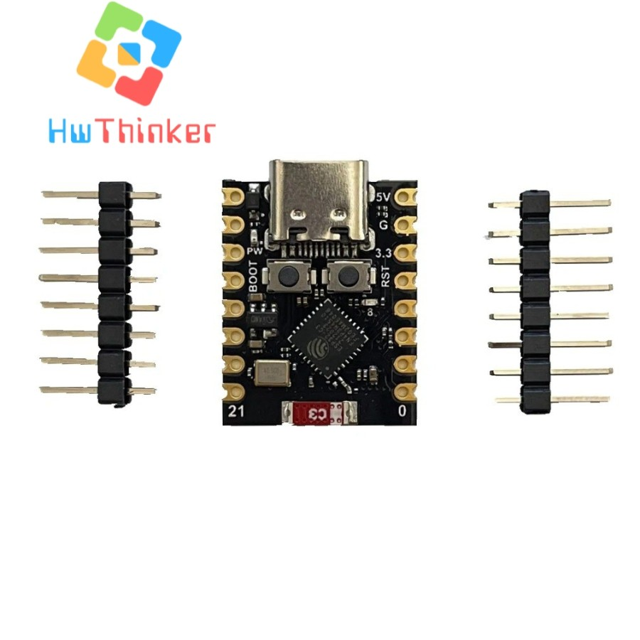

Selamat datang di repository panduan dan seri tutorial **ESP32-C3 Super Mini** (Nologo / SuperMini Board). ESP32-C3 adalah mikrokontroler RISC-V 32-bit berkinerja tinggi yang dilengkapi dengan Wi-Fi 2.4 GHz dan Bluetooth 5 (BLE), dikemas dalam bentuk fisik yang sangat ringkas (*ultra-small footprint*).

Dokumen ini berisi dokumentasi setup awal, cara upload, solusi *troubleshooting*, serta **seri tutorial bertahap** dari tingkat dasar hingga menengah.

---

## 📌 Daftar Isi

1. [Spesifikasi & Pinout Board](#-spesifikasi--pinout-board)
2. [Modul 1: Persiapan Environment & Instalasi Board](#-modul-1-persiapan-environment--instalasi-board)
   - [Instalasi di Arduino IDE](#11-instalasi-board-di-arduino-ide)
   - [Konfigurasi di PlatformIO](#12-konfigurasi-di-platformio)
   - [Prosedur Upload & Boot Mode Manual](#13-prosedur-upload--boot-mode-manual)
3. [Modul 2: Basic Digital & Analog I/O](#-modul-2-basic-digital--analog-io)
   - [Tutorial 2.1: Onboard LED Blink](#tutorial-21-onboard-led-blink)
   - [Tutorial 2.2: Membaca Tombol Eksternal (Digital Input)](#tutorial-22-membaca-tombol-eksternal-digital-input)
   - [Tutorial 2.3: Kontrol Kecerahan LED dengan PWM (LEDC)](#tutorial-23-kontrol-kecerahan-led-dengan-pwm-ledc)
4. [Modul 3: Komunikasi Serial & Debugging](#-modul-3-komunikasi-serial--debugging)
   - [Tutorial 3.1: USB CDC Serial Monitor](#tutorial-31-usb-cdc-serial-monitor)
   - [Tutorial 3.2: Serial Reception (Menerima Perintah Serial)](#tutorial-32-serial-reception-menerima-perintah-serial)
5. [Modul 4: Membaca Sensor Analog (ADC)](#-modul-4-membaca-sensor-analog-adc)
   - [Tutorial 4.1: Reading Potentiometer / Analog Input](#tutorial-41-reading-potentiometer--analog-input)
6. [Modul 5: Interfacing I2C (Display OLED 0.96")](#-modul-5-interfacing-i2c-display-oled-096)
   - [Tutorial 5.1: Menampilkan Teks & Data pada OLED I2C](#tutorial-51-menampilkan-teks--data-pada-oled-i2c)
7. [Modul 6: Wi-Fi & Web Server](#-modul-6-wi-fi--web-server)
   - [Tutorial 6.1: Menghubungkan ESP32-C3 ke Jaringan Wi-Fi](#tutorial-61-menghubungkan-esp32-c3-ke-jaringan-wi-fi)
   - [Tutorial 6.2: Web Server Sederhana Kontrol LED](#tutorial-62-web-server-sederhana-kontrol-led)
8. [Modul 7: Bluetooth Low Energy (BLE)](#-modul-7-bluetooth-low-energy-ble)
   - [Tutorial 7.1: BLE Server / Beacon Sederhana](#tutorial-71-ble-server--beacon-sederhana)
9. [Modul 8: Deep Sleep & Management Daya](#-modul-8-deep-sleep--management-daya)
   - [Tutorial 8.1: Timer Wakeup Deep Sleep](#tutorial-81-timer-wakeup-deep-sleep)
10. [Pemecahan Masalah (Troubleshooting)](#-pemecahan-masalah-troubleshooting)

---

## 📐 Spesifikasi & Pinout Board

### Spesifikasi Utama
- **MCU**: ESP32-C3FH4 RISC-V 32-bit Single-Core up to 160 MHz
- **Flash Memory**: 4 MB SPI Flash
- **Konektivitas Wireless**: Wi-Fi 2.4 GHz (802.11 b/g/n) & Bluetooth 5.0 (BLE)
- **Port USB**: Type-C (Internal USB CDC/JTAG Controller)
- **Onboard LED**: GPIO 8 (Active LOW: `LOW` = Nyala, `HIGH` = Mati)
- **Onboard Buttons**: Tombol **BOOT** (GPIO 9) & Tombol **RESET (EN)**
- **Tegangan Kerja**: 3.3 V (Input VCC 5V via USB Type-C atau Pin 5V)

### Peta Pinout Header
```
           +--------------------+
     5V -- | [ ]            [ ] | -- GPIO 5 (ADC1_CH5)
    GND -- | [ ]            [ ] | -- GPIO 4 (ADC1_CH4 / Touch)
    3V3 -- | [ ]            [ ] | -- GPIO 3 (ADC1_CH3)
GPIO 10 -- | [ ]  ESP32-C3  [ ] | -- GPIO 2 (ADC1_CH2)
 GPIO 9 -- | [ ] SuperMini  [ ] | -- GPIO 1 (ADC1_CH1)
 GPIO 8 -- | [ ] [LED]      [ ] | -- GPIO 0 (ADC1_CH0)
 GPIO 7 -- | [ ]            [ ] | -- GPIO 20 (RXD)
 GPIO 6 -- | [ ]            [ ] | -- GPIO 21 (TXD)
           +--------[USB]-------+
```

---

## 🛠️ Modul 1: Persiapan Environment & Instalasi Board

### 1.1 Instalasi Board di Arduino IDE

1. Buka Arduino IDE, masuk ke menu **File -> Preferences** (atau `Ctrl + ,`).

   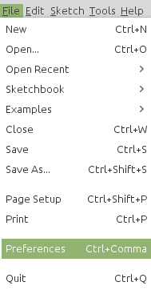

2. Klik ikon di samping kolom **Additional Boards Manager URLs**.

   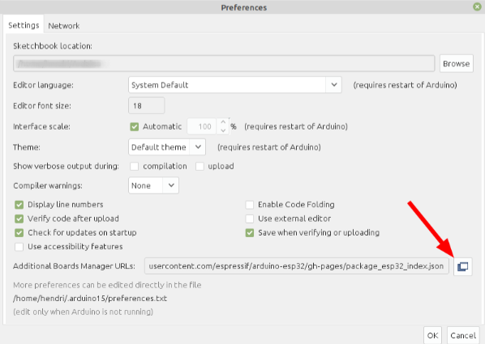

3. Tambahkan URL package board ESP32 berikut:
   `https://raw.githubusercontent.com/espressif/arduino-esp32/gh-pages/package_esp32_index.json`

   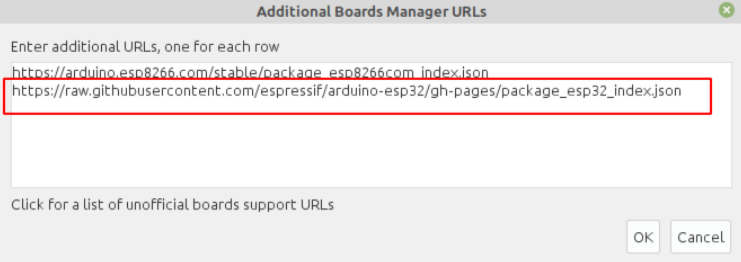

4. Buka **Tools -> Board -> Boards Manager...**

   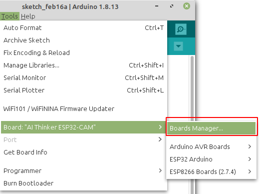

5. Cari `esp32` oleh Espressif Systems, lalu klik **Install**.

   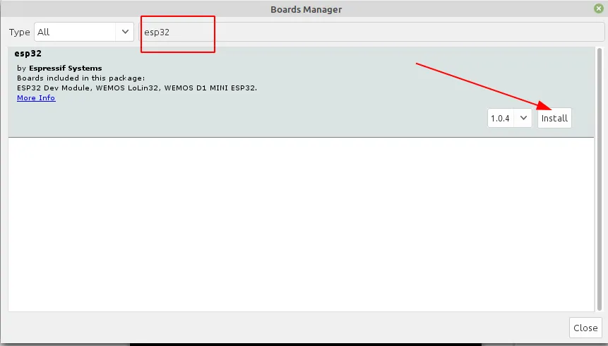

6. Setelah selesai, pilih Board via **Tools -> Board -> ESP32 Arduino -> ESP32C3 Dev Module** (atau **Nologo ESP32C3** pada versi core terbaru).

   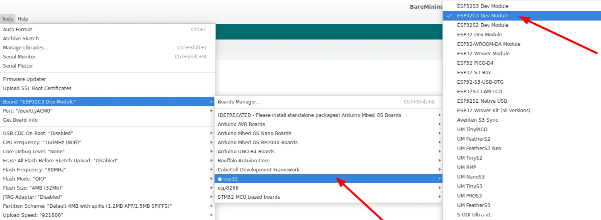

7. Pada Arduino IDE 2.0+, Anda juga bisa memilih Board langsung dari drop-down menu di toolbar atas.

   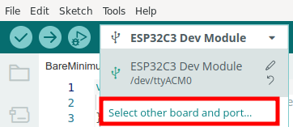

   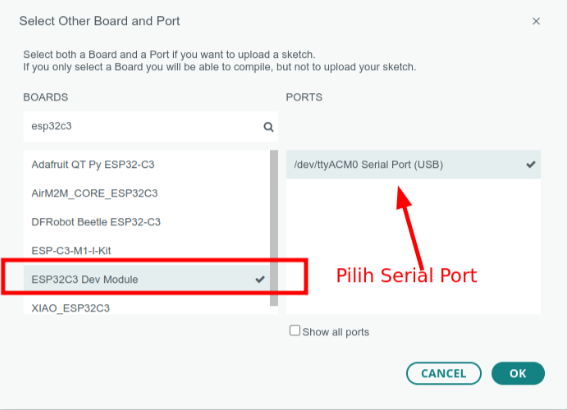

8. **PENTING (USB CDC)**: Ubah opsi **USB CDC On Boot** menjadi **"Enabled"**. Opsi ini wajib diaktifkan agar fungsi `Serial.print()` / `Serial.println()` dapat mengirim data melalui port USB Type-C bawaan ESP32-C3.

   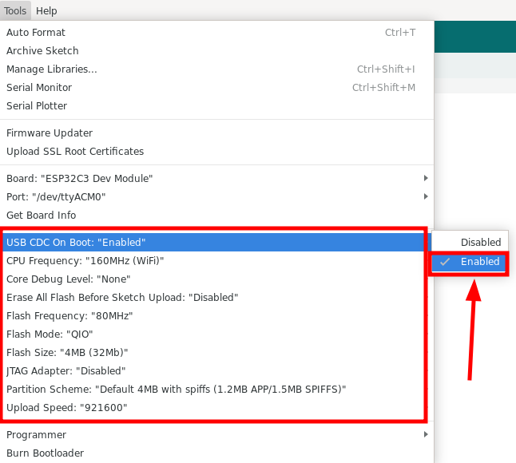

9. Untuk tes awal, Anda bisa membuka contoh sketch di **File -> Examples -> 01.Basics -> Blink**.

   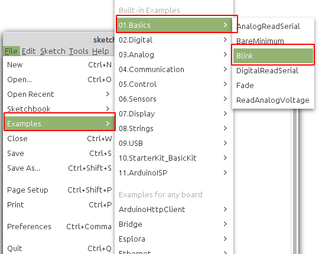

10. Hubungkan board ke komputer via kabel USB Type-C. Pilih port COM yang sesuai (Bisa dicek via Device Manager di Windows).

   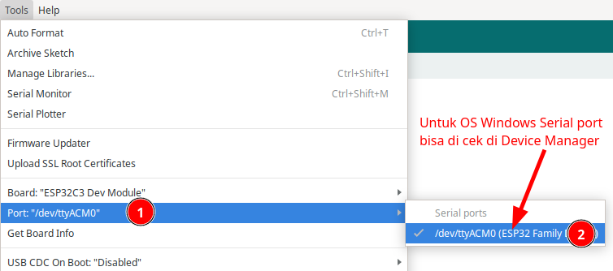

> [!NOTE]
> Pada versi core ESP32 Arduino terbaru, Anda juga dapat memilih board pabrikan Nologo secara langsung: **Nologo ESP32C3**.
>
> 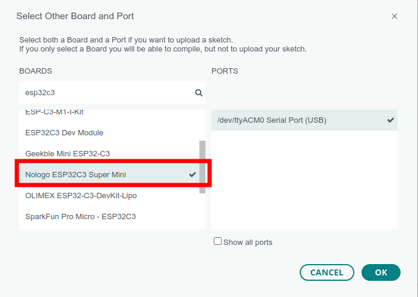
>
> 

---

### 1.2 Konfigurasi di PlatformIO

Jika Anda menggunakan VS Code + PlatformIO, tambahkan parameter `build_flags` untuk mengaktifkan USB CDC pada file `platformio.ini`:

```ini
[env:esp32c3_supermini]
platform = espressif32
board = esp32-c3-devkitc-02
framework = arduino
monitor_speed = 9600
build_flags =
    -DARDUINO_USB_CDC_ON_BOOT=1
    -DARDUINO_USB_MODE=1
```

*Penjelasan*: `-DARDUINO_USB_CDC_ON_BOOT=1` menginstruksikan driver Arduino core agar mengarahkan output `Serial` ke USB CDC internal pada saat startup.

---

### 1.3 Prosedur Upload & Boot Mode Manual

Jika saat melakukan proses upload Arduino IDE / PlatformIO menampilkan log kendala sambungan seperti ini:

```text
esptool.py v3.0-dev
Serial port COM...
Connecting........_____....._____.....__
```

Lakukan prosedur masuk ke **Mode Download (Bootloader Mode)** secara manual:

1. Tekan dan **tahan tombol BOOT (GPIO 9)**.
2. Sambil menahan tombol BOOT, **tekan dan lepas tombol RESET (EN)** 1x.
3. **Lepaskan tombol BOOT**.
4. Klik tombol **Upload** di Arduino IDE / PlatformIO.
5. Bila proses upload berhasil, akan muncul konfirmasi penulisan flash:
   ```text
   Writing at 0x00010000... (12 %)
   Writing at 0x00014000... (25 %)
   ...
   Hash of data verified.
   ```
6. **LANGKAH WAJIB PASCA UPLOAD**: Tekan tombol **RESET (EN)** 1 kali untuk berpindah dari mode bootloader ke mode eksekusi program (*Run Mode*).

---

## 💡 Modul 2: Basic Digital & Analog I/O

### Tutorial 2.1: Onboard LED Blink

ESP32-C3 Super Mini memiliki satu unit LED indikator terhubung ke **GPIO 8**. LED ini bersifat **Active LOW** (`LOW` = Menyala, `HIGH` = Mati).

```cpp
#include <Arduino.h>

const int LED_PIN = 8; // Onboard LED pada ESP32-C3 Super Mini

void setup() {
  pinMode(LED_PIN, OUTPUT);
}

void loop() {
  digitalWrite(LED_PIN, LOW);   // Menyalakan LED (Active LOW)
  delay(500);
  digitalWrite(LED_PIN, HIGH);  // Mematikan LED
  delay(500);
}
```

---

### Tutorial 2.2: Membaca Tombol Eksternal (Digital Input)

Tutorial ini membaca status push button yang dihubungkan ke **GPIO 4** menggunakan resistor Pull-Up internal. Saat tombol ditekan (terhubung ke GND), LED onboard (GPIO 8) akan menyala.

#### Skema Rangkaian
- **Push Button Pin 1**: Terhubung ke `GPIO 4`
- **Push Button Pin 2**: Terhubung ke `GND`

```cpp
#include <Arduino.h>

const int BUTTON_PIN = 4; // Pin Tombol Eksternal
const int LED_PIN = 8;    // Onboard LED

void setup() {
  pinMode(LED_PIN, OUTPUT);
  // Gunakan INPUT_PULLUP agar pin tidak floating saat tombol dilepas
  pinMode(BUTTON_PIN, INPUT_PULLUP);
}

void loop() {
  int buttonState = digitalRead(BUTTON_PIN);

  if (buttonState == LOW) {
    // Tombol ditekan (ditarik ke GND)
    digitalWrite(LED_PIN, LOW);  // LED Nyala
  } else {
    // Tombol dilepas (Pull-Up HIGH)
    digitalWrite(LED_PIN, HIGH); // LED Mati
  }
}
```

---

### Tutorial 2.3: Kontrol Kecerahan LED dengan PWM (LEDC)

ESP32-C3 menyertakan periferal LED Control (LEDC) bawaan untuk menghasilkan sinyal PWM (Pulse Width Modulation).

```cpp
#include <Arduino.h>

const int LED_PIN = 8;
const int PWM_FREQ = 5000;    // Frekuensi PWM 5 kHz
const int PWM_RES = 8;        // Resolusi 8-bit (nilai 0 - 255)

void setup() {
  // Menghubungkan pin GPIO 8 ke kanal PWM
  ledcAttach(LED_PIN, PWM_FREQ, PWM_RES);
}

void loop() {
  // Fade IN (Meningkatkan kecerahan)
  for (int dutyCycle = 0; dutyCycle <= 255; dutyCycle++) {
    ledcWrite(LED_PIN, 255 - dutyCycle); // Inverted karena Active LOW
    delay(5);
  }

  // Fade OUT (Redup hingga mati)
  for (int dutyCycle = 255; dutyCycle >= 0; dutyCycle--) {
    ledcWrite(LED_PIN, 255 - dutyCycle);
    delay(5);
  }
}
```

---

## 📡 Modul 3: Komunikasi Serial & Debugging

### Tutorial 3.1: USB CDC Serial Monitor

Board ini menggunakan controller USB CDC bawaan. Program berikut menyinkronkan koneksi serial dan mengirimkan status LED secara berkala.

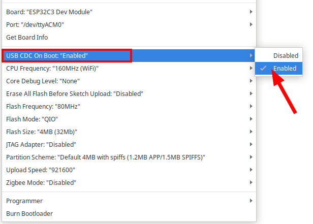

```cpp
#include <Arduino.h>

const int LED_PIN = 8;

void setup() {
  Serial.begin(9600);
  
  // Menunggu hingga koneksi CDC USB Serial aktif (Opsional namun disarankan)
  while (!Serial && millis() < 3000) {
    delay(10);
  }
  
  pinMode(LED_PIN, OUTPUT);
  Serial.println("--- ESP32-C3 Super Mini Serial Debug Ready ---");
}

void loop() {
  digitalWrite(LED_PIN, LOW);
  Serial.println("Status LED: SANYALA (OFF di monitor logic LOW)");
  delay(500);

  digitalWrite(LED_PIN, HIGH);
  Serial.println("Status LED: MATI (ON di monitor logic HIGH)");
  delay(1000);
}
```

#### Langkah Pengujian:
1. Upload kode ke board.
2. Buka **Serial Monitor** (Baud rate `9600`).
3. Tekan **RESET** pada board. Amati log text yang muncul di Serial Monitor.

---

### Tutorial 3.2: Serial Reception (Menerima Perintah Serial)

Mengendalikan LED onboard melalui input karakter teks dari Serial Monitor (`1` = ON, `0` = OFF).

```cpp
#include <Arduino.h>

const int LED_PIN = 8;

void setup() {
  Serial.begin(9600);
  pinMode(LED_PIN, OUTPUT);
  digitalWrite(LED_PIN, HIGH); // Default LED Mati
  Serial.println("Ketik '1' untuk menyalakan LED, '0' untuk mematikan:");
}

void loop() {
  if (Serial.available() > 0) {
    char command = Serial.read();

    if (command == '1') {
      digitalWrite(LED_PIN, LOW); // Active LOW: Nyala
      Serial.println("> Perintah Diterima: LED NYALA");
    } else if (command == '0') {
      digitalWrite(LED_PIN, HIGH); // Active LOW: Mati
      Serial.println("> Perintah Diterima: LED MATI");
    }
  }
}
```

---

## 🎛️ Modul 4: Membaca Sensor Analog (ADC)

### Tutorial 4.1: Reading Potentiometer / Analog Input

ESP32-C3 memiliki modul ADC 12-bit (resolusi nilai 0 hingga 4095, dengan rentang tegangan 0 - 3.3V).

#### Skema Rangkaian
- **Potensiometer Pin Kiri**: Terhubung ke `GND`
- **Potensiometer Pin Tengah**: Terhubung ke `GPIO 0` (ADC1_CH0)
- **Potensiometer Pin Kanan**: Terhubung ke `3V3`

```cpp
#include <Arduino.h>

const int ADC_PIN = 0; // GPIO 0 (ADC1_CH0)

void setup() {
  Serial.begin(9600);
  analogReadResolution(12); // Resolusi ADC 12-bit (0 - 4095)
}

void loop() {
  int rawValue = analogRead(ADC_PIN);
  float voltage = (rawValue / 4095.0) * 3.3;

  Serial.print("Raw ADC: ");
  Serial.print(rawValue);
  Serial.print(" | Tegangan: ");
  Serial.print(voltage, 2);
  Serial.println(" V");

  delay(500);
}
```

---

## 🖥️ Modul 5: Interfacing I2C (Display OLED 0.96")

### Tutorial 5.1: Menampilkan Teks & Data pada OLED I2C

Layar OLED 0.96" SSD1306 (128x64) dikontrol menggunakan protokol I2C. 

#### Pinout Rangkaian I2C Default:
- **VCC**: Terhubung ke `3V3` atau `5V`
- **GND**: Terhubung ke `GND`
- **SDA**: Terhubung ke `GPIO 5` (atau GPIO 8)
- **SCL**: Terhubung ke `GPIO 6` (atau GPIO 9)

> **Library yang Dibutuhkan**: Install `Adafruit SSD1306` dan `Adafruit GFX Library` via Library Manager.

```cpp
#include <Wire.h>
#include <Adafruit_GFX.h>
#include <Adafruit_SSD1306.h>

#define SCREEN_WIDTH 128
#define SCREEN_HEIGHT 64

// Deklarasi pin I2C kustom untuk ESP32-C3 Super Mini
#define I2C_SDA 5
#define I2C_SCL 6

Adafruit_SSD1306 display(SCREEN_WIDTH, SCREEN_HEIGHT, &Wire, -1);

void setup() {
  Serial.begin(9600);

  // Inisialisasi bus I2C dengan pin custom SDA & SCL
  Wire.begin(I2C_SDA, I2C_SCL);

  if (!display.begin(SSD1306_SWITCHCAPVCC, 0x3C)) {
    Serial.println(F("Gagal menemukan layar OLED SSD1306!"));
    for (;;);
  }

  display.clearDisplay();
  display.setTextSize(1);
  display.setTextColor(SSD1306_WHITE);
  
  display.setCursor(0, 10);
  display.println("ESP32-C3 SuperMini");
  display.println("==================");
  display.println("Status: Active");
  display.println("OLED I2C Ready!");
  
  display.display();
}

void loop() {
  // Loop kosong
}
```

---

## 🌐 Modul 6: Wi-Fi & Web Server

### Tutorial 6.1: Menghubungkan ESP32-C3 ke Jaringan Wi-Fi

```cpp
#include <WiFi.h>

const char* ssid = "NAMA_WIFI_ANDA";
const char* password = "PASSWORD_WIFI_ANDA";

void setup() {
  Serial.begin(9600);
  delay(1000);

  Serial.print("Menghubungkan ke Wi-Fi ");
  Serial.println(ssid);

  WiFi.begin(ssid, password);

  while (WiFi.status() != WL_CONNECTED) {
    delay(500);
    Serial.print(".");
  }

  Serial.println("");
  Serial.println("Terhubung ke Wi-Fi!");
  Serial.print("IP Address: ");
  Serial.println(WiFi.localIP());
}

void loop() {
  // Tidak ada proses di loop
}
```

---

### Tutorial 6.2: Web Server Sederhana Kontrol LED

Program ini membuat Web Server berbasis HTTP pada ESP32-C3 untuk mengontrol LED onboard via browser di HP atau Laptop yang berada dalam satu jaringan Wi-Fi.

```cpp
#include <WiFi.h>
#include <WebServer.h>

const char* ssid = "NAMA_WIFI_ANDA";
const char* password = "PASSWORD_WIFI_ANDA";

WebServer server(80);
const int LED_PIN = 8;

void handleRoot() {
  String html = "<html><body>";
  html += "<h2>ESP32-C3 Super Mini Web Control</h2>";
  html += "<p><a href=\"/led/on\"><button style=\"padding:10px 20px; font-size:16px;\">NYALAKAN LED</button></a></p>";
  html += "<p><a href=\"/led/off\"><button style=\"padding:10px 20px; font-size:16px;\">MATIKAN LED</button></a></p>";
  html += "</body></html>";
  server.send(200, "text/html", html);
}

void handleLedOn() {
  digitalWrite(LED_PIN, LOW); // Active LOW
  server.sendHeader("Location", "/");
  server.send(303);
}

void handleLedOff() {
  digitalWrite(LED_PIN, HIGH); // Active LOW
  server.sendHeader("Location", "/");
  server.send(303);
}

void setup() {
  Serial.begin(9600);
  pinMode(LED_PIN, OUTPUT);
  digitalWrite(LED_PIN, HIGH);

  WiFi.begin(ssid, password);
  while (WiFi.status() != WL_CONNECTED) {
    delay(500);
    Serial.print(".");
  }

  Serial.println("\nWi-Fi Connected!");
  Serial.print("Buka IP ini di Browser: http://");
  Serial.println(WiFi.localIP());

  server.on("/", handleRoot);
  server.on("/led/on", handleLedOn);
  server.on("/led/off", handleLedOff);

  server.begin();
}

void loop() {
  server.handleClient();
}
```

---

## 📱 Modul 7: Bluetooth Low Energy (BLE)

### Tutorial 7.1: BLE Server / Beacon Sederhana

ESP32-C3 memiliki modul Bluetooth 5.0 BLE terintegrasi. Contoh ini membuat BLE Server yang menyiarkan nama device `"ESP32C3-SuperMini"`.

```cpp
#include <BLEDevice.h>
#include <BLEUtils.h>
#include <BLEServer.h>

#define SERVICE_UUID        "4fafc201-1fb5-459e-8fcc-c5c9c331914b"
#define CHARACTERISTIC_UUID "beb5483e-36e1-4688-b7f5-ea07361b26a8"

void setup() {
  Serial.begin(9600);
  Serial.println("Mengaktifkan BLE Server...");

  BLEDevice::init("ESP32C3-SuperMini");
  BLEServer *pServer = BLEDevice::createServer();
  BLEService *pService = pServer->createService(SERVICE_UUID);

  BLECharacteristic *pCharacteristic = pService->createCharacteristic(
                                         CHARACTERISTIC_UUID,
                                         BLECharacteristic::PROPERTY_READ |
                                         BLECharacteristic::PROPERTY_WRITE
                                       );

  pCharacteristic->setValue("Halo dari ESP32-C3 Super Mini!");
  pService->start();

  BLEAdvertising *pAdvertising = BLEDevice::getAdvertising();
  pAdvertising->addServiceUUID(SERVICE_UUID);
  pAdvertising->setScanResponse(true);
  pAdvertising->setMinPreferred(0x06);
  pAdvertising->setMinPreferred(0x12);
  BLEDevice::startAdvertising();

  Serial.println("BLE Device aktif & siap di-scan via HP (misal aplikasi nRF Connect)!");
}

void loop() {
  delay(2000);
}
```

---

## 💤 Modul 8: Deep Sleep & Management Daya

### Tutorial 8.1: Timer Wakeup Deep Sleep

Deep sleep memungkinkan ESP32-C3 menghemat daya (arus konsumsi turun hingga ~5 µA), sangat cocok untuk aplikasi bertenaga baterai / solar panel.

```cpp
#include <Arduino.h>

#define uS_TO_S_FACTOR 1000000ULL /* Faktor konversi mikrodetik ke detik */
#define TIME_TO_SLEEP  5          /* Durasi tidur (dalam detik) */

const int LED_PIN = 8;

void setup() {
  Serial.begin(9600);
  pinMode(LED_PIN, OUTPUT);

  // Nyalakan LED sebentar sebagai penanda bangun
  digitalWrite(LED_PIN, LOW);
  delay(1000);
  digitalWrite(LED_PIN, HIGH);

  Serial.println("ESP32-C3 Bangun! Menjalankan tugas...");
  Serial.println("Memulai Deep Sleep selama 5 detik...");

  // Konfigurasi Timer Wakeup
  esp_sleep_enable_timer_wakeup(TIME_TO_SLEEP * uS_TO_S_FACTOR);
  
  // Masuk ke Mode Deep Sleep
  esp_deep_sleep_start();
}

void loop() {
  // Kode di loop tidak akan dieksekusi karena board di-reset ulang setiap kali bangun dari Deep Sleep.
}
```

---

## 🔧 Pemecahan Masalah (Troubleshooting)

### A. Port COM tidak dikenali di OS / Arduino IDE
- **Penyebab**: Chipset USB CDC belum beralih ke mode unduh.
- **Solusi**: Tekan & Tahan tombol **BOOT (GPIO 9)** -> Tekan & Lepas tombol **RESET (EN)** -> Lepaskan tombol **BOOT**.

### B. Program tidak berjalan setelah proses upload berhasil
- **Penyebab**: ESP32-C3 masih berada di mode *download bootloader*.
- **Solusi**: Tekan tombol **RESET (EN)** 1x setelah upload selesai untuk memulai eksekusi skrip utama.

### C. Serial Monitor tidak menampilkan pesan output (`Serial.print`)
- **Penyebab**: Fitur USB CDC pada Boot belum diaktifkan.
- **Solusi**: 
  - Pada Arduino IDE: Masuk ke **Tools -> USB CDC On Boot** -> Pilih **Enabled**.
  - Pada PlatformIO: Pastikan file `platformio.ini` memiliki `-DARDUINO_USB_CDC_ON_BOOT=1`.

### D. Pin GPIO 8 dan GPIO 9 Berperilaku Aneh
- **Catatan**: 
  - **GPIO 8** terhubung secara fisik ke LED bawaan board.
  - **GPIO 9** terhubung ke tombol BOOT (*Strapping Pin*). Jika dihubungkan ke rangkaian eksternal, pastikan tidak menarik pin ini ke LOW pada saat booting awal.

---

## 🔗 Referensi & Link Terkait

- [Dokumentasi Resmi Nologo ESP32-C3 SuperMini](https://www.nologo.tech/product/esp32/esp32c3SuperMini/esp32C3SuperMini.html)
- [Espressif ESP32-C3 Official Datasheet](https://www.espressif.com/sites/default/files/documentation/esp32-c3_datasheet_en.pdf)
- [Arduino ESP32 Core GitHub Repository](https://github.com/espressif/arduino-esp32)