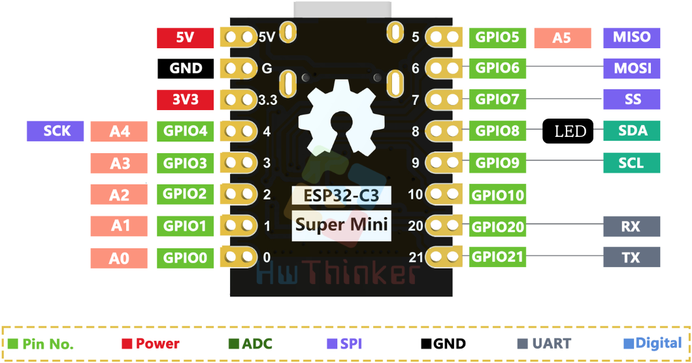
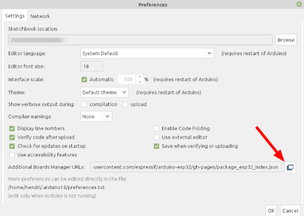
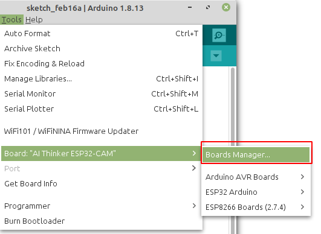

# ESP32 C3 Super Mini

**Tutorial ESP32 C3 Super Mini**



# Install Board

1. Masuk ke preferences


2. Klik Additional Board Manager



3. Tambahkan board esp32 kalimat berikut https://raw.githubusercontent.com/espressif/arduino-esp32/gh-pages/package_esp32_index.json


4. Pilih Tools -> Board -> Board Manager



5. Search ESP32 kemudian klik install


6. Pilih Tools -> Board -> ESP32 -> esp32C3 dev Module


7. Untuk Arduino 2.0 bisa juga Klik board pada main bar


8. kemudian pilih ESP32C3 Dev Module


9. Ubah opsi CDC on Boot menjadi “**enable**”, ini perlu supaya serial bisa bekerja dengan baik


10. Pilih Example -> Basic -> blink


11. Setting port serial , untuk windows bisa cek device manager, pastikan anda telah install driver serial usb anda


12. Upload program

**CARA UPLOAD** klik upload program di komputer. akan muncul tulisan

```cpp
- ---esptool.py v3.0-dev
- ---Serial port COM…
- ---Connecting........_____....._____.....__
```

---

- **Tekan dan tahan** tombol Boot bersamaan itu Klik(**tekan dan lepas**) tombol reset
- **Lepas** tombol reset/EN dan **tetap tekan** tombol 0/Boot . akan muncul info berikut

```cpp
- ---Compressed 261792 bytes to 122378...
- ---Writing at 0x00010000... (12 %)
- ---Writing at 0x00014000... (25 %)
- ---Writing at 0x00018000... (37 %)
```

---

- Bila sudah muncul tulisan Writing at 0x0000e000... (sekian %), maka tombol Boot boleh dilepas
- Setelah itu Wajib klik tombol reset sekali lagi untuk berpindah dari mode download menjadi mode run

> [!NOTE]  
> INGAT YA WAJIB Di Klik Tombol RESET setelah proses upload selesai, tanpa itu program yang baru diupload tidak akan dijalankan

---

Contoh program blinky

```cpp
// the setup function runs once when you press reset or power the board

void setup() {

// initialize digital pin LED_BUILTIN as an output.

pinMode(LED_BUILTIN, OUTPUT);

}

// the loop function runs over and over again forever

void loop() {

digitalWrite(LED_BUILTIN, HIGH); // turn the LED on (HIGH is the voltage level)

delay(1000); // wait for a second

digitalWrite(LED_BUILTIN, LOW); // turn the LED off by making the voltage LOW

delay(1000); // wait for a second

}
```

---